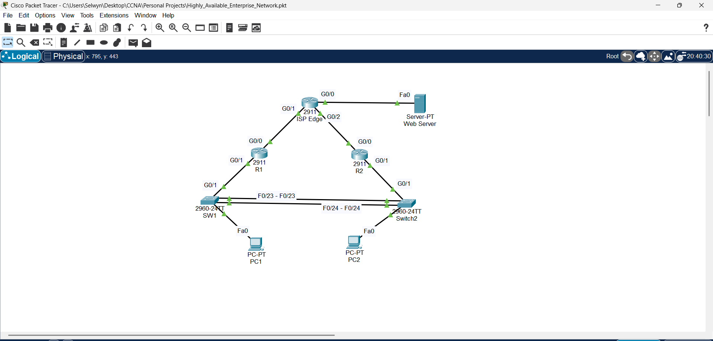

# High-Availability Enterprise Network Design
### CCNA-Level Implementation of HSRP, LACP, and NAT

## 🖼️ Network Topology

## 🚀 Project Goal
To design and validate a fault-tolerant edge architecture that ensures uninterrupted internet access for LAN users in the event of a device or link failure.

## 🛠️ Technical Implementation Details

### **Layer 3 Redundancy (HSRP)**
* **Active Router (R1):** Configured with HSRP Priority 110 and Preemption.
* **Standby Router (R2):** Configured with default priority to take over if R1 fails.
* **Virtual Gateway:** Provided a consistent VIP (192.168.10.1) for all internal hosts.

### **Layer 2 Redundancy (LACP & STP)**
* **EtherChannel:** Aggregated F0/23 and F0/24 into Port-Channel 1 using LACP (mode active).
* **STP Optimization:** Manually adjusted PVST+ bridge priorities to ensure SW1 acts as the Root Bridge for VLAN 10.

### **WAN & Security**
* **NAT Overload (PAT):** Permitted internal 192.168.10.0/24 hosts to access the ISP via R1/R2 public interfaces.
* **Static Routing:** Implemented default routes pointing toward the ISP Edge (10.0.0.1 and 10.0.0.5).

## 🧪 Verification Steps
1. **Redundancy Test:** Performed `tracert 8.8.8.8` from PC1, then shutdown R1 G0/1. Verified traffic automatically rerouted through R2.
2. **Bandwidth Aggregation:** Verified Port-Channel 1 status using `show etherchannel summary`.

## Files in this Repository
* `Highly Available Enterprise Network.pkt` – Cisco Packet Tracer simulation file
* `configs/` – Running configurations for R1, R2, and Switches
* `NetworkTopology.png` – High-resolution topology diagram

## Author
**Selwyn Fernandes**
CCNA Certified | Junior Network Engineer
